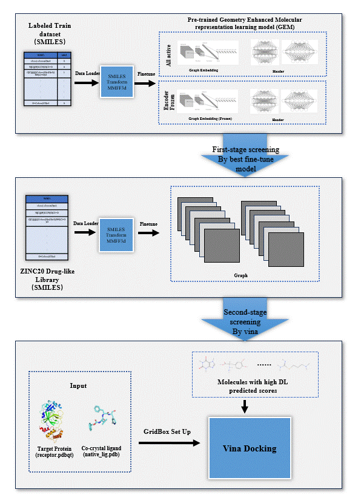

# D2Screen



## Installation

```bash
# Create & activate env
conda create -n d2screen python=3.10 -y
conda activate d2screen
conda install -c conda-forge rdkit=2023.09.6 vina=1.2.5 biopython=1.84 -y
pip install paddlepaddle-gpu==2.6.1.post120 #choose the wheel that matches your CUDA
pip install -r requirements.txt
```

## Preparation for input data
 1. fientne dataset (input.csv) in datasets/input.csv floder
 ```
 # formate example
ID,SMILES,label
116363,c1ccc(-c2ccccn2)nc1,0
103573,COc1ccc(-c2cc(=O)c3c(OC)c(OC)c(OC)c(OC)c3o2)cc1,0
104712,N#Cc1cnc2cnc(NCc3cccnc3)cc2c1Nc1ccc(F)c(Cl)c1,0
110269,COc1ccc2c(c1)CN(C(=O)CCl)C(c1ccccc1)C2,1
```

2. receptor.pdbqt
Preprocessed receptor file in the pdbqt formate under datasets/receptor.pdbqt. Require to remove solvent and crystal ligand. 
There is a website where you can easily transfer you .pdb file to .pdbqt. 
```
https://www.cheminfo.org/Chemistry/Cheminformatics/FormatConverter/index.html
```

3. native_lig.pdb
co-crystal ligand structure (pdb format) from the target protein should be put under datasets/target_protein/native_lig.pdb
This is used for calculation of the grid center and boxsize.


## Step 1: Finetune on downstream task and prediction
```
python train.py --dataset <train.csv> --project_name <run_name>  --thread_num 1 
python prediction.py --project_name <run_name> --mode 'ZINC' --threshold <cutoff score [0,1]>  --ZINC_dir <molecular libray fold>
```
**Arguments** (`train.py`)

| Argument         | Type | Default      | Description |
|------------------|------|--------------|-------------|
| `--dataset`      | str  | **required** | Path to the training dataset (CSV). |
| `--project_name` | str  | `"finetune"` | Name of the project. Used to create output directories. |
| `--thread_num`   | int  | `1`          | Number of CPU threads for preprocessing/training. |
| `--seed`         | int  | `42`         | Random seed for reproducibility. |

---

## Step 2: transfer smile to pdbqt
We provide ligand_prep.py for fast convertion of smiles representation of molecules to pdbqt format, which can be put into autodock vina. For conformation optimization, MMFF94 is ussed. All hytrogen is kept. 
```
python smile2pdbqt.py --dataset <DL_top.csv> --grid_center <crystal_ligand.pdb>
```
We highly recommend you to upload your own prepared pdbqt file for more accurate 3D comformation. To do this, upload your pdbqt files under the datasets/ligand_prep/ floder. 


## Step 3: docking by vina
grid center and boxsize is calculated by LaBox algrithm
Cite: Ryan Loke. (2023). RyanZR/LaBOX: LaBOX v1.0.2 (v1.0.2). Zenodo. https://doi.org/10.5281/zenodo.8241444
```
python docking.py --receptor <receptor.pdbqt> --ligand_dir <ligand_dir> --grid_center <crystal_ligand.pdb>
```

## reference
* [Fang, X., Liu, L., Lei, J., He, D., Zhang, S., Zhou, J., ... & Wang, H. (2022). Geometry-enhanced molecular representation learning for property prediction. Nature Machine Intelligence, 4(2), 127-134.](https://doi.org/10.1038/s42256-021-00438-4)

* [J. Eberhardt, D. Santos-Martins, A. F. Tillack, and S. Forli. (2021). AutoDock Vina 1.2.0: New Docking Methods, Expanded Force Field, and Python Bindings. Journal of Chemical Information and Modeling.](https://pubs.acs.org/doi/10.1021/acs.jcim.1c00203) 
* [O. Trott and A. J. Olson. (2010). AutoDock Vina: improving the speed and accuracy of docking with a new scoring function, efficient optimization, and multithreading. Journal of computational chemistry, 31(2), 455-461.](https://onlinelibrary.wiley.com/doi/10.1002/jcc.21334)